# Beautiful in White - T2A2

# R7 - Identification of the problem:
COVID-19 pandemic outbreak has deeply impacted weddings and the wedding related industry worldwide. The estimated revenue loss from COVID-19 of bridal stores industry in Australia is around $108.6 million in 2019-2020. [Bridal Stores in Australia - Market Research Report](https://www.ibisworld.com/au/industry/bridal-stores/4002/) According to news reports, the outbreak is also changing the way people seek and shop for wedding dresses. Couples that prepare to get married in the future have either postponed shopping or shopped for wedding dresses online. [Link](https://www.ibisworld.com/industry-insider/press-releases/called-off-covid-19-has-profoundly-impacted-weddings-and-events/) I want to create an online platform for bridal store owners across the world and for brides who are looking for dream wedding dresses.

# R8 - Why is it a problem that needs solving:
Many couples' weddings have been temporarily canceled/postponed because of COVID-19. Due to social distancing, some bridal stores are not able to continue to make a profit. However, in foreseeable future, the wedding industry will still 'thrive' post-pandemic.[Link](https://www.nbcnews.com/pop-culture/pop-culture-news/how-coronavirus-could-change-wedding-culture-even-after-pandemic-ends-n1185506) In order to help local bridal shops turn loss into gain during this period of time and help them increase customer reach in the coming future. I build this platform which enables them to display their products in their "virtual shops" and receive payments through Stripe. 

On the other hand, it is often hard for customers to find affordable wedding dresses that suit their needs in traditional physical stores. According to business analysis, resale wedding dresses are becoming more and more popular among modern brides. Eco-conscious millennial brides tend to seek wedding dresses from a fast-growing industry selling secondhand wedding dresses/accessories at bargain prices. [Link](https://www.businessinsider.sg/millennial-brides-buy-secondhand-wedding-gowns-2019-7) The app provides customers with different choices (brand new products and second-hand products). Customers can also resell their preowned wedding dresses to recoup the cost. Afterall, "Why would you spend thousands of dollars on a dress that you wear for one day and then keep it in the closet for years when you can resell it online?”

### R9 - A link (URL) to my deployed app:
https://beautiful-in-white.herokuapp.com/

### R10 - A link to the GitHub repository:
https://github.com/Lanzhou-J/wedding-dress-app

# R11 - Description of my marketplace app:

## Purpose
One of the purpose of the app is to help bridal shops across the world connect with new customers, make profits through e-commerce; Another purpose is for customers to find their dream wedding dresses and resell it to other customers if they want to.

## Functionality and features:
### Functionality 1: Shopping cart
Customers can add products (from different shops) to their carts or delete unwanted products from their carts. They can make payments via Stripe. After an item is sold, it will display "SOLD" on the show page and can not be added to a new cart. 

### Functionality 2: Add products to virtual shops
Users can create a new shop if they want to sell things in the marketplace. They are able to edit shop information, Add a picture of the shop and add products(wedding dresses) to their virtual shops. A user can only manipulate products that belong to him or her. In order to make the process of adding products easier, I used dropdown lists for seller to select dress attributes such as Silhouette, Neckline, Length, Sleeve, Size etc.

### Functionality 3: Easy-to-use Admin dashboard
Admins of the web app can either manipulate products/shops on the website directly or use an admin dashboard created by ruby gem RailsAdmin. By using the dash board, admins can manipulate records in the database, including Carts, Dresses, Shops, Users etc.

### Feature 1: Display shop location on map
By using Geocoding and Mapbox, the location of the shop will be displayed on a map if the address information of the shop is provided by the shop owner.

### Feature 2: Landing page
The website has a responsive Landing page that links to the introduction of the web app and Login/ Signup page. Only authenticated users are able to view/buy/sell products.

### Feature 3: Display pictures of new products in the shop card

In the shops index page, pictures of 2 newly-added products of the shop is displayed on the shop card, which makes a shop more attractive to customers and can also encourage shop owners to add new products to the shop.

## Sitemap

The website has pages link to each other via the navigation bar or "view"/"back" buttons. A sitemap for the website is presented below.

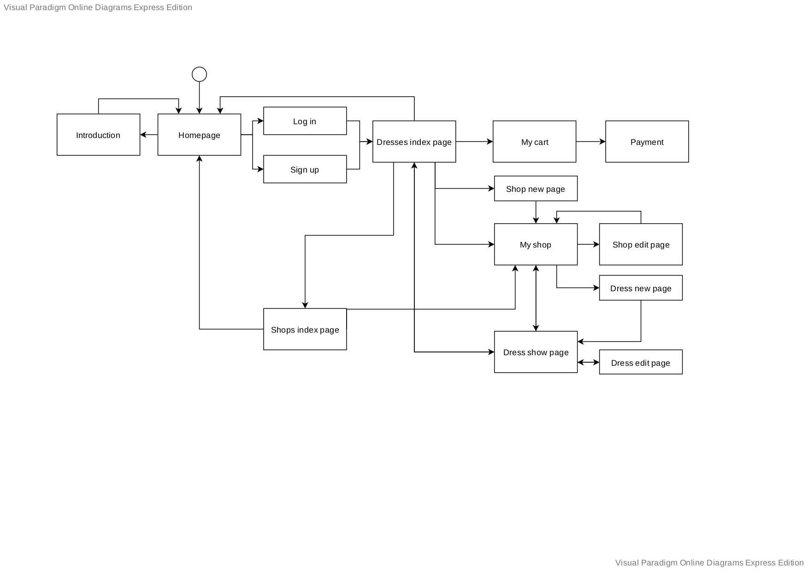

## Screenshots

##### Home page
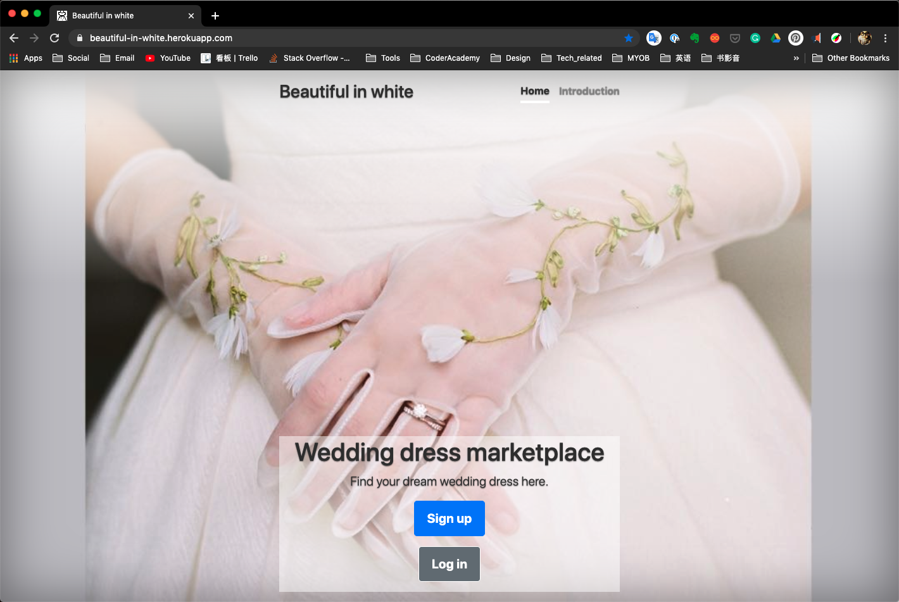

##### Login page
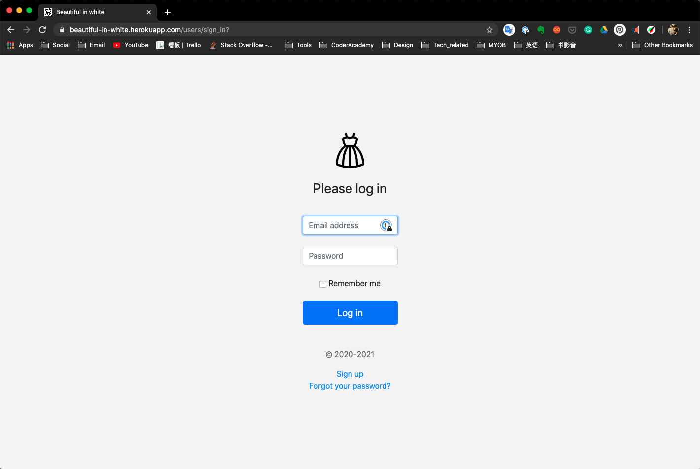

##### Wedding dresses index page
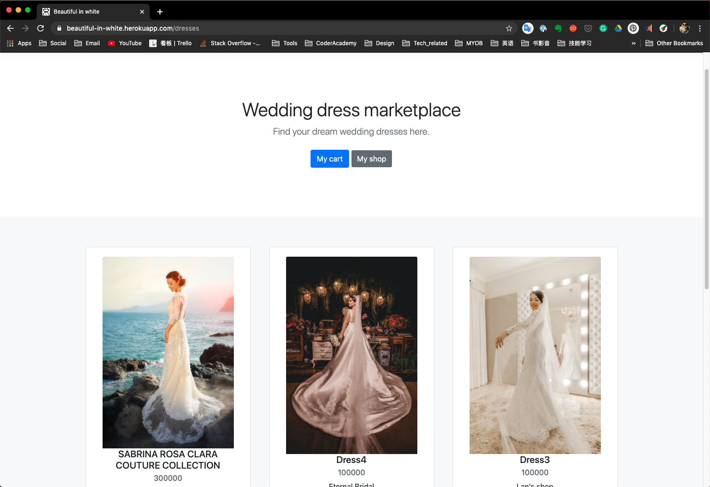

##### Wedding dress show page
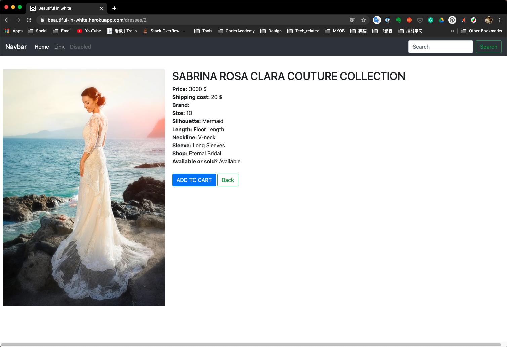

##### Shops index page
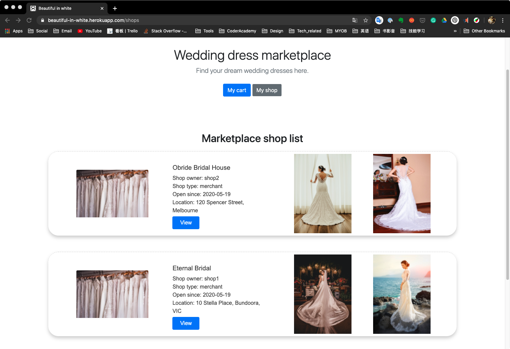

##### Shop show page
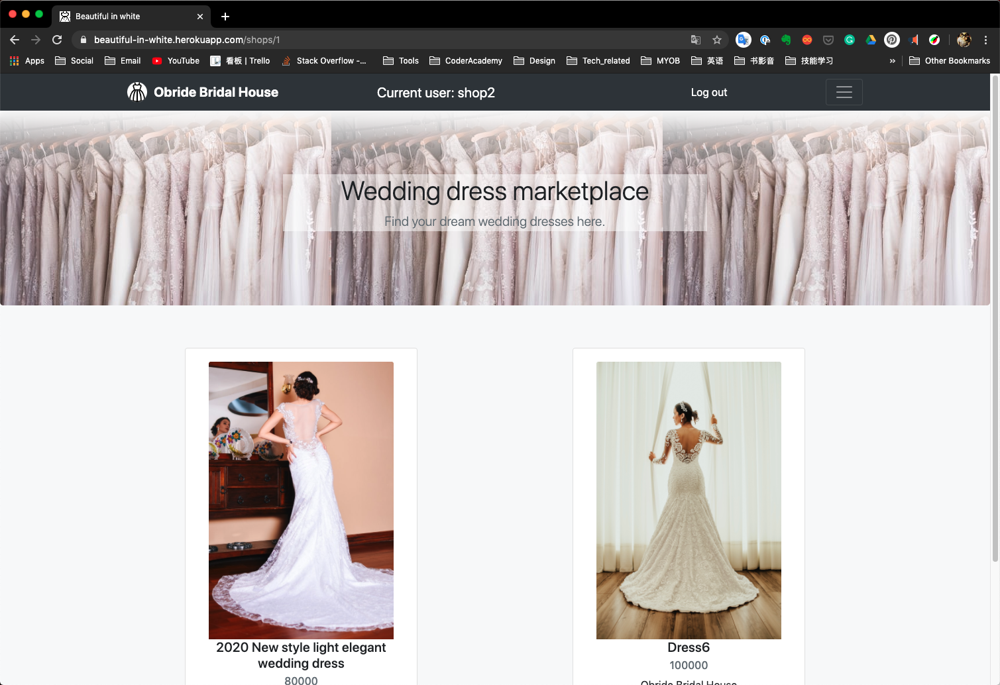

## Target audience

The target audience for the website are:

1. Brides/couples planing for the wedding
2. Wedding dress designers
3. Bridal shop owners
4. Brides who want to resell their wedding dresses

## Tech stack
- Ruby on Rails
- HTML
- Bootstrap and Sass
- RSpec

# R12 - User stories for my app
- As a Bridal wedding dresses shop owner (merchant) or designer, I want to use this platform to display all my products/designs of wedding dresses. I want to do business online and receive payments successfully. I also hope that the customers are able to find the location of my physical store so that they can pick up products if they want to or visit my shop in the future.

- As a customer, I want to use this platform to find wedding dresses that suit me. I also want to add a product to a cart so that I can purchase multiple items at once.

- As a bride, I want to use the platform to sell preowned, second-hand wedding dresses after the wedding.

- As an admin of the platform, I want to manage the data (e.g. users, dresses, shops) of the app on a easy-to-use dashboard.

# R13 - Wireframes:
I used mobile first design priciple when designing the wireframes. Wireframes were created for each page during the planning stage of the project. Wireframes are presented below. The tools that I used to create wireframes are Balsamic wireframes Desktop and Procreate app on ipad.

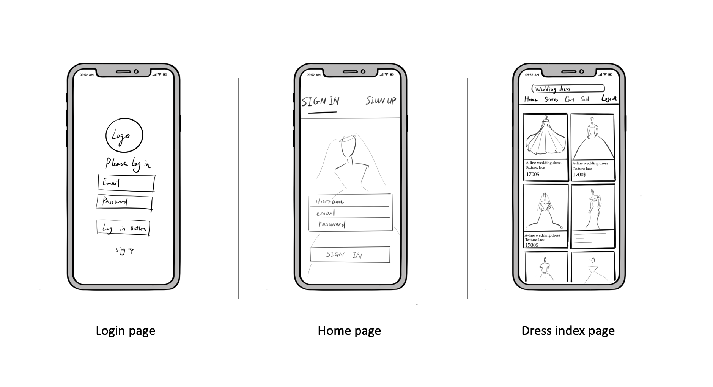

Shops index page
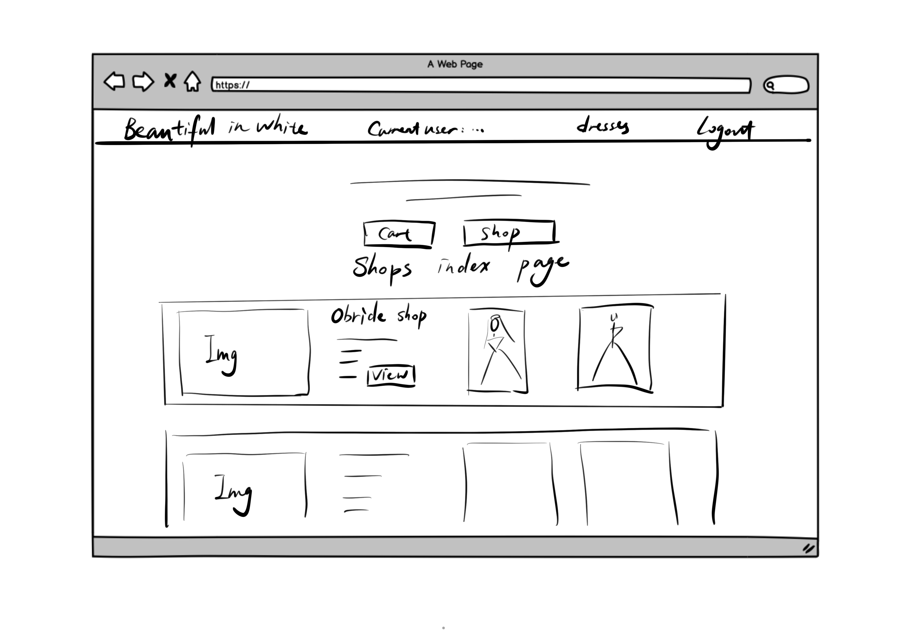

# R14 - An ERD for my app
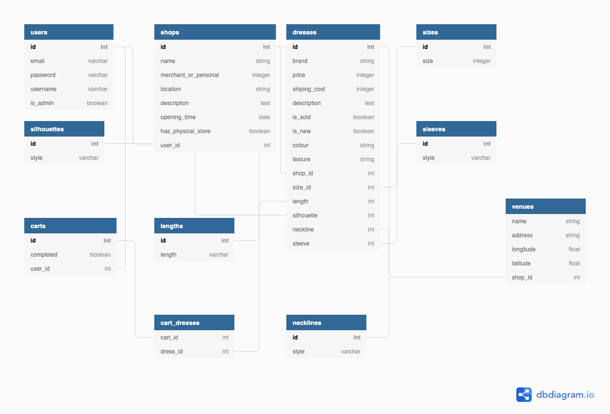

# R15 - Explain the different high-level components (abstractions) in the app:

### Active Record:
  Active Record is one of the examples of a higher level component that is used in my app.
  
   - ```ActiveRecord::Base``` is used when creating the classes that will be stored in the database tables. According to [RailsGuides](https://guides.rubyonrails.org/active_record_basics.html), in Rails 6.0.3, all models will inherit from ApplicationRecord (an abstract class).
      ```Ruby
      class Dress < ApplicationRecord
      end
      ```
      and ```ApplicationRecord``` inherits from ```ActiveRecord::Base``` (```ActiveRecord``` module with the ```Base``` class inside of it). 
      ```Ruby
      class ApplicationRecord < ActiveRecord::Base
        self.abstract_class = true
      end
      ```
  - ```ActiveRecord::Migration``` is used for creating, updating, and deleting tables from the database. It can migrate schema information to the database of the application. [Link](https://medium.com/@lukepierotti/querying-in-activerecord-why-sql-is-still-important-91ac014ab57)

  ActiveRecord module provides us with many functionalities, e.g. we can establish a connection to the database; create database tables; define associations between different tables; establish an ORM(object relational mapping) between Ruby classes/objects/attributes and the tables/rows/columns in the corresponding database. [Link](https://www.bogotobogo.com/RubyOnRails/RubyOnRails_Active_Records.php) Active Record also automatically creates methods to allow our applications to read and manipulate data that is stored in the tables (CRUD functions: create, read, update and delete records). Actually ActiveRecord runs SQL queries, it facilitates programmers by bundling common SQL query methods into simple ruby class methods such as `Dress.create()`, `Dress.find()` etc.

### Action View
In Rails, when we create forms in .erb view files we don't need to use html tags (e.g.`<label>`, `<form>` etc.) anymore. Instead, I used methods (e.g. `.label`, `.text_field`, `.file_field` etc.) That is achieved by Action View, a built-in module that is responsible to look for and render our views. Action View can also provide many helpers (e.g. Form helpers that facilitates programmers to create HTML forms). [Link](https://medium.com/datadriveninvestor/what-is-action-view-e5455f79f251) 

Normally the final HTML output is consisted of 3 parts: `Templates`, `Partials` and `Layouts`. [RailsGuides](https://guides.rubyonrails.org/action_view_overview.html)
 - Templates: Rails supports different template systems, for example, ERB template, an HTML file using ERB template system has `.html.erb` as a file extension. Within the ERB template Ruby code is included in `<% %>`(does not return an output) or `<%= %>`(used when return output) tags.
 - Partials: For example, I used `_card.html.erb` to render dress cards in my dresses index page. Similarly I used `_shopcard.html.erb` to render shop cards in the shops index page. Partial templates can break the rendering process into smaller chunks and reuse them in the app.
 - Layouts: They are used to render view templates that are repeatedly used in the app. For example, a navigation bar or a footer bar that is used across all pages in the rails app.

### Active Storage

Nowadays nearly all the web apps allow users to upload files such as images. By doing so, users are able to custom their avatar image, or update a picture of a product for sell. ActiveStorage is a module that allows app users to upload files easily. It facillitates uploading files to a cloud storage service such as Amazon S3, Google Cloud Storage, Microsoft Azure and attach the files to objects that Active Record created.

In my app I declared Active Storage services (`local`, `test`, and `amazon`) in `config/storage.yml`. I used Amazon S3 to store images uploaded by users in production environment (in `production.rb`).
```Ruby
# Store files on Amazon S3
config.active_storage.service = :amazon
```
I use local disk-based service for development environment (in `development.rb`)
```Ruby
  # Store uploaded files on the local file system
  config.active_storage.service = :local
```
And I used test service for testing.
```Ruby
# Store uploaded files on the local file system in a temporary directory.
config.active_storage.service = :test
```
In order to attach pictures to records, I used `has_one_attached` macro both in `models/dress.rb` and `models/shop.rb`. It sets up a one-to-one relationship between records and files uploaded. [RailsGuides](https://guides.rubyonrails.org/v5.2.0/active_storage_overview.html)

# R16 - Third party services:
- Heroku: It is used to deploy this application.
- Amazon S3: S3 is for data storage that can be accessed via a url. In this app, it is used to store images that are uploaded (in production environment).
- Stripe: It is used for making and receiving payments for users of the app. It handles PCI compliance for us.
- Geocoding: A third party API used for converting addresses into geographic coordinates (longitude and latitude).
- Mapbox: Used with Geocoding, use the longitude and latitude value of the address of a shop to show the location of it on a map.
- Devise: A ruby gem used for user authentication.
- Cancancan: A ruby gem used for user authorization.
- RailsAdmin: A Rails engine that provides a clean interface for managing data that can be used by admins of the app.
- PostgreSQL: I used this free relational database to store/manage records for the app.

# R17 - Describe my projects models in terms of the relationships they have with each other.
### Users
- has many carts
- has one shop

Once a user sign up to the website, his or her first cart will be created at the same time. If a user is a seller, he/she can choose to create a shop (and that shop belongs to him/her)
### Shops
- has many dresses
- belongs to user
- has one venue
- has one picture attached
### Venues
- belongs to shop

A shop belongs to a user, it has a venue that is related to the location attribute of the shop. A shop has many dresses so shop owner can list products in the shop show page. A shop has one attached picture to attract more customers.

### Dresses
- belongs to shop
- belongs to size
- belongs to length
- belongs to neckline
- belongs to silhouette
- belongs to sleeve
- has one picture attached
### Silhouettes
- has many dresses
### Sizes
- has many dresses
### Sleeves
- has many dresses
### Necklines
- has many dresses
### Lengths
- has many dresses

A dress belongs to a shop, it has one product picture attached. A wedding dress has many attributes, in order to make it easier for sellers to create a new dress I used dropdown select field for Silhoettes/Sizes/Sleeves/Necklines and Lengths. A silhouette/sleeve/neckline/length style has many dresses. Similarly, a size has many dresses.

# Discuss the database relations to be implemented:

# Database schema design:

# Project Management
## Trello

Tasks were allocated and tracked using Trello. Trello board screenshots presented below:

##### 16/05/2020
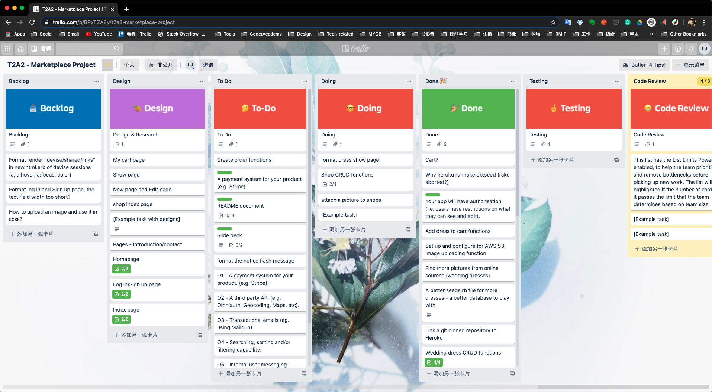

##### 20/05/2020


##### This action returns all of the listing records and sends them to the index view