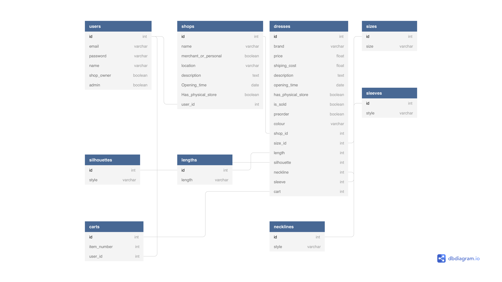

# Beautiful in White - T2A2

# Identification of the problem:

# Why is it a problem that needs solving:

### A link (URL) to my deployed app:
https://beautiful-in-white.herokuapp.com/

### A link to the GitHub repository:
https://github.com/Lanzhou-J/wedding-dress-app

# Description of my marketplace app:

## Purpose

## Functionality and features:
### Functionality 1: Navigation Bar and Footer Bar

### Functionality 2: Multilingual versions of homepage

### Functionality 3: 

### Feature 1: 

### Feature 2: 

### Feature 3: 

## Sitemap

The website simply has all pages link to each other via the navigation bar. A sitemap for the website is presented below.

## Screenshots

##### Home page

##### Login and Signup page

##### Wedding dresses index page

##### Wedding dress show page

##### Shops index page

##### Shop show page

## Target audience

The target audience for the website are:

1. Brides
2. Wedding dress Designers
3. Bridal shop owners

## Tech stack
- Ruby on Rails
- HTML is used to structure the content of all the webpages.
- Bootstrap and Scss is used to style the webpages.
- Heroku is used to deploy the rails app.

# User stories for my app
- As a Bridal wedding dresses shop owner (merchant) or designer, I want to use this platform to display all my products including wedding dresses and accessories, and do business online. I also want to take orders and communicate with customers for designing custom wedding dresses.

- As a customer, I want to use this platform to find wedding dresses that suit me and communicate with other brides, see their comments and ratings of a particular product.

- As a bride who has already had the wedding, I would use the platform to sell preowned, used and second-hand wedding dresses.

# Wireframes:
Wireframes were created for each page during the planning stage of the project. Wireframes are presented below. The tools that I used to create wireframes are Balsamic wireframes Desktop and Procreate app on ipad.

##### Homepage

##### Wedding dresses index page

# An ERD for my app

# Explain the different high-level components (abstractions) in the app:

# Third party services:

# Describe my projects models in terms of the relationships they have with each other.

# Discuss the database relations to be implemented:

# Database schema design:

# Project Management
## Trello

Tasks were allocated and tracked using Trello. Trello board screenshots presented below:

##### 16/05/2020

##### 20/05/2020

This README would normally document whatever steps are necessary to get the
application up and running.

Things you may want to cover:

* Ruby version

* System dependencies

* Configuration

* Database creation

* Database initialization

* How to run the test suite

* Services (job queues, cache servers, search engines, etc.)

* Deployment instructions

* ...
